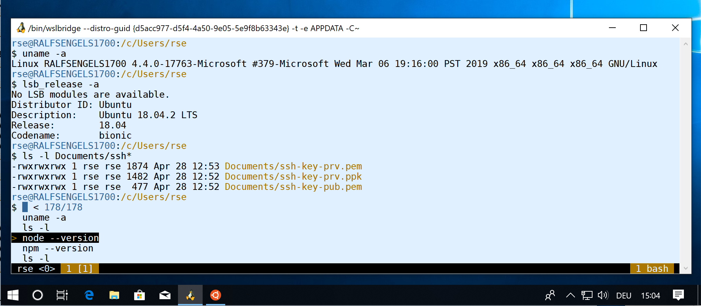

Author: [Dr. Ralf S. Engelschall](mailto:rse@engelschall.com) 
Version: 2.1.9 (2020-05-07)

# Unix Environment under Windows

This is a documentation on how to setup a reasonable but opinionated Unix development environment under
[*Microsoft Windows 10*](https://windows.com) (Pro edition, 64-bit mode, version &ge; 1809) with the help of the
native [*Windows Subsystem for Linux (WSL)*](https://devblogs.microsoft.com/commandline/),
the [*Ubuntu*](https://www.ubuntu.com/) GNU/Linux distribution,
Dr. Ralf S. Engelschall's [*Unix dotfiles*](https://github.com/rse/dotfiles) shell environment,
the terminal emulator [*MinTTY/WSLTTY*](https://github.com/mintty/wsltty) and
the [*Docker Desktop for Windows*](https://www.docker.com/products/docker-desktop)
container execution platform.

> Notice: In short, the crux of this setup in contrast to the usual standard WSL setups is:
>
> - convenient root access (password-less `sudo`)
> - reasonably mapped home directory (`/c/Users/$USER`)
> - essential Unix shell configurations for Bash, Vim, Vifm, TMux and Git ("dot-files")
> - essential Unix shell tools (OpenSSH, RSYNC, etc)
> - additional WSL shell tools (`wsl-open`)
> - improved host terminal emulator (MinTTY/WSLTTY)
> - host SSH agent with transparent access from within WSL (`weasel-pageant`)
> - host Docker engine with transparent access from within WSL (`$DOCKER_HOST`)
> - optionally, essential programming languages (C/C++/Go/Perl/JavaScript/Java)

## Install Windows Subsystem for Linux (WSL)

1. **Ensure Windows 10 Professional/Enterprise, 64 Bit, Version &ge; 18.09**: 
   Ensure you are running Windows 10 Professional or Windows 10
   Enterprise in 64-bit mode and in Version 1809 (October 2018), 1903
   (April 2019), 1909 (November 2019) or newer.

   > Rationale: Windows Subsystem for Linux (WSL) is available only
   > under those Windows editions, only under 64-bit and in a reasonable
   > fashion only under at least this version or newer.
   > Windows 10 in Version 1809 is the bare minimum. The recommended
   > system is Windows 10 in Version 1909.

   - *START* &rarr; *Settings* &rarr; *System* &rarr; *About*:
   - ... *Device Specifications* &rarr; *System type*
   - ... *Windows Specifications* &rarr; *Edition*
   - ... *Windows Specifications* &rarr; *Version*

   Notice:

   > If you have a different edition or you are running in 32-bit mode,
   > you are out of luck with WSL. Sorry, then you have to went with
   > [MSYS2](https://www.msys2.org/) or [Cygwin](https://www.cygwin.com/).
   > If you want to perform a fresh Windows 10 installation, start over with Microsoft's
   > [Download Windows 10 Disc Image (ISO File)](https://www.microsoft.com/en-us/software-download/windows10ISO/).
   > If you just still have an older Windows version, upgrade with one of the following
   > two options:
   >
   > - Windows Updates: *START* &rarr; `windows update settings` <kbd>RETURN</kbd>
   > - Windows Upgrades: [Windows 10 Update Assistant](https://www.microsoft.com/software-download/windows10)

2. **Enable Windows Subsystem for Linux**: 
   Enable the Windows feature *Windows Subsystem for Linux*.

   > Rationale: Windows Subsystem for Linux is the core feature we want to use.

   - *START* &rarr; `powershell` &rarr; <kbd>RIGHT-CLICK</kbd> &rarr; *Run as administrator*
   - `Enable-WindowsOptionalFeature -Online -FeatureName Microsoft-Windows-Subsystem-Linux`

   Alternatively:

   - *START* &rarr; `control panel` &rarr; *Programs* &rarr; *Programs and Features*
     &rarr; *Turn Windows features on or off* &rarr; *Windows-Subsystem for Linux*

   > Notice: In case you have trouble to enable *Windows Subsystem for Linux*, this can have many reasons.
   > In most cases, the reason is that point (1) above is not exactly fulfilled. Start over there again.

## Install Ubuntu GNU/Linux Operating System

1. **Install Ubuntu 20.04 LTS**: 
   Install Ubuntu GNU/Linux 20.04 Long Term Support (LTS) from the Microsoft Store.

   > Rationale: you need a reasonable GNU/Linux distribution and it should receive updates for a longer time.

   - *START* &rarr; `microsoft store` &rarr; *Search* &rarr; `ubuntu 20.04 lts` &rarr; *Get* &rarr; *Launch*

   Just be patient on first launch, it really takes time.
   Then, when asked for your username, enter the same as your Windows username.
   When asked for your password, enter either your Windows password or another one, but
   remember it (at least once until the step where we configure sudo(8) below)!

   > Notice: In case the Microsoft Store is not available on your system, the reason
   > can be that you still have User Account Control (UAC) disabled, or
   > you are still not signed in with a Microsoft Account (although it
   > should be not required), or your Windows is still not activated or
   > you are still running an evaluation version of Windows. Anyway, try
   > to fix the problems the following way:
   > 
   > - *START* &rarr; *Settings* &rarr; *Updates & Security* &rarr; *Troubleshoot* &rarr; *Windows Store Apps* &rarr; *Run the troubleshooter*

## Setup Ubuntu GNU/Linux Operating System

1. **Enter Ubuntu under WSL**: 
   Enter Ubuntu GNU/Linux under Windows Subsystem for Linux.

   > Rationale: we have to setup Ubuntu from itself.

    - *START* &rarr; *Ubuntu 20.04*

2. **Enable Convenient Root Access**: 
   Ensure no password is needed for subsequent root access.

   > Rationale: just convenience only -- feel free to ignore if you want to enter your password over and over again.

    - `sudo vi /etc/sudoers` 
      &larr; `%sudo ALL=(ALL:ALL) ALL` 
      &rarr; `%sudo ALL=(ALL:ALL) NOPASSWD: ALL`

3. **Upgrade Ubuntu Operating System**: 
   Upgrade to the latest package versions of Ubuntu and allow APT to use HTTPS.

   > Rationale: you always want the latest updates and Docker later needs HTTPS access.

   - `sudo apt-get update`
   - `sudo apt-get upgrade -y --with-new-pkgs`
   - `sudo apt-get install -y apt-transport-https ca-certificates curl gnupg-agent software-properties-common`

4. **Mount Windows directories in WSL with Meta-Data enabled**: 
   Configure the mounting of Windows directories in WSL (`/c` instead of `/mnt/c`) and with *Meta-Data* enabled.

   > Rationale: allow POSIX file permissions on Windows drives from within WSL.

    - `sudo vi /etc/wsl.conf` 
      &rarr; `[automount]` 
      &rarr; `root    = /` 
      &rarr; `options = "metadata"`

5. **Use Combined Home Directory**: 
   Map the Unix home directory to the regular Windows home directory.

   > Rationale: just convenience only -- feel free to ignore.

    - `exec sudo usermod -d /c/Users/$USER $USER`

   > Notice: Don't panic, we have to `exec` the command here to release the current user's processes
   > and this way let `usermod` proceed. This will immediately close the Unix terminal, of course.

   This step is a tricky one as the running WSL sub-process might not allow the changing of
   the underlying user home directory as long as it is running itself. One safe alternative is to
   execute the following command from within a CMD or PowerShell terminal:

    - `wsl sudo usermod -d /c/Users/%USERNAME% %USERNAME%`

## Configure Unix Shell Environment

1. **Re-Enter Ubuntu under WSL**: 
   Re-Enter Ubuntu GNU/Linux under Windows Subsystem for Linux again.

   > Rationale: we have to configure the Unix environment from itself.

    - *START* &rarr; *Ubuntu 20.04*

2. **Install Essential Unix Tools**: 
   Install all necessary essential and some more useful Unix tools.

   > Rationale: the subsequent Unix Shell Configurations are partially based on them and you really want a decent Unix environment.

   First, install the tools which available via standard package manager:

   - `sudo apt-get install -y bash less vim vifm tmux`
   - `sudo apt-get install -y procps lsof dnsutils tcpdump`
   - `sudo apt-get install -y openssh-client stunnel subversion git curl`
   - `sudo apt-get install -y mc tree file findutils`
   - `sudo apt-get install -y rsync rdup rclone restic w3m lftp`
   - `sudo apt-get install -y atool gzip bzip2 xz-utils zip unzip`
   - `sudo apt-get install -y diffutils diffstat patch patchutils par`
   - `sudo apt-get install -y openssl gnupg golang-cfssl apg uuid bc`
   - `sudo apt-get install -y imagemagick ghostscript poppler-utils`

   Second, install the tool [FZF](https://github.com/junegunn/fzf) which is not available
   (at least not in latest version) via standard package manager:

   - `curl -skLO https://github.com/junegunn/fzf-bin/releases/download/0.21.1/fzf-0.21.1-linux_amd64.tgz`
   - `tar zxf fzf-0.21.1-linux_amd64.tgz`
   - `sudo install -c -m 755 fzf /usr/local/bin/`
   - `rm fzf fzf-0.21.1-linux_amd64.tgz fzf`

   Third, install the tool [Git-Town](https://www.git-town.com) which is not available via standard package manager:

   - `curl -skLO https://github.com/Originate/git-town/releases/download/v7.3.0/git-town-amd64.deb`
   - `sudo dpkg -i git-town-amd64.deb`
   - `rm git-town-amd64.deb`

   Forth, install the tool [TTY2Web/GoTTY](https://github.com/kost/tty2web) which is not available via standard package manager:

   - `curl -skLO https://github.com/kost/tty2web/releases/download/v2.4.0/tty2web_linux_amd64`
   - `sudo install -c -m 755 tty2web* /usr/local/bin/tty2web`
   - `rm tty2web*`

3. **Install Unix Shell Configurations**: 
   Install Dr. Ralf S. Engelschall's essential Unix dotfiles.

   > Rationale: you really want a reasonable pre-configured Unix shell environment.

   - `sudo apt-get install -y make`
   - `curl -skLO https://github.com/rse/dotfiles/archive/master.zip`
   - `unzip -x master.zip`
   - `(cd dotfiles-master && sudo make install)`
   - `rm -rf dotfiles-master`
   - `rm master.zip`
   - `dotfiles -f ~`

4. **Install Unix Shell Addon Configurations**: 
   Install Dr. Ralf S. Engelschall's Bash-FZF and Bash-ENVRC addons.

   > Rationale: you really want a reasonable pre-configured Unix shell environment.
   > This especially includes an improved <kbd>CTRL+r</kbd> functionality in Bash, which then opens
   > an FZF-based search functionality (which you can see in the screenshot above, too).

   - `curl -skL https://raw.githubusercontent.com/rse/bash-fzf/master/bash-fzf.rc -o ~/.bash-fzf.rc`
   - `curl -skL https://raw.githubusercontent.com/rse/bash-envrc/master/bash-envrc.rc -o ~/.bash-envrc.rc`

4. **Extend Unix Shell Configurations**: 
   Extend the Unix shell configuration with your personal information.

   > Rationale: these informations individualize your environment (replace the `<xxx>` placeholders, please).

   - `vi ~/.dotfiles/gitconfig` 
     &rarr; `[user]` 
     &rarr; `user  = <username>` 
     &rarr; `name  = <firstname> <lastname>` 
     &rarr; `email = <firstname>.<lastname>@<domain>` 

6. **Install WSL Utilities**: 
   Install additional WSL utilities.

   > Rationale: you want additional features inside WSL.

   - `sudo apt-get install -y ubuntu-wsl wslu`
   - `curl -skLO https://github.com/4U6U57/wsl-open/archive/master.zip`
   - `unzip -x master.zip`
   - `sudo install -c -m 755 wsl-open-master/wsl-open.sh /usr/local/bin/wsl-open`
   - `sudo mkdir -p /usr/local/share/man/man1`
   - `sudo install -c -m 644 wsl-open-master/wsl-open.1 /usr/local/share/man/man1/`
   - `rm -rf wsl-open-master`
   - `rm master.zip`
   - `vi ~/.dotfiles/bashrc` 
      &rarr; `PATH=$PATH:/c/Windows/System32/WindowsPowerShell/v1.0/` 
      &rarr; `alias open=wsl-open`

## Install MinTTY/WSLTTY Terminal Emulator

1. **Install MinTTY/WSLTTY**: 
   Install the WSLTTY variant of MinTTY.

   > Rationale: a reasonable terminal emulator has to be used and the default WSL console is not good enough.

   - [WSLTTY version &ge; 3.1.0.2](https://github.com/mintty/wsltty/releases) &rarr; `wsltty-*-install.exe`
   - <kbd>WIN+r</kbd> &rarr; `%LOCALAPPDATA%\wsltty` &rarr; `add to context menu.lnk`

2. **Install DejaVu Sans Mono font**: 
   Install a perfect monospaced font for the terminal emulator.

   > Rationale: MinTTY/WSLTTY configuration below references it.

   - download: [DejaVu Sans](https://dejavu-fonts.github.io/Download.html) &rarr; `dejavu-fonts-ttf-*.zip`
   - extract: `dejavu-fonts-ttf-*.zip` &rarr; <kbd>RIGHT-CLICK</kbd> *Extract all*
   - install: `dejavu-fonts-ttf-*\ttf\` &rarr; select all `*.ttf` &rarr; <kbd>RIGHT-CLICK</kbd> &rarr; *Install*

3. **Install MinTTY/WSLTTY Configuration**: 
   Install Dr. Ralf S. Engelschall's MinTTY/WSLTTY configuration.

   > Rationale: reasonable colors and fonts should be used in the terminal emulator.

   - download: [MinTTY-config](https://github.com/rse/mintty-config/archive/master.zip)
   - extract: `master.zip` &rarr; <kbd>RIGHT-CLICK</kbd> *Extract all*
   - copy: `mintty-config-master\config`
   - paste: `%APPDATA%\wsltty` (override `config` file)

4. **Make MinTTY/WSLTTY easily accessible**: 
   Pin MinTTY/WSLTTY to the Windows taskbar and additionally assign it to the global Windows hotkey <kbd>CTRL+ALT+c</kbd>.

   > Rationale: easy and quick access to the Unix shell

   - *START* &rarr; `wsl terminal` &rarr; <kbd>RIGHT-CLICK</kbd> *Pin to taskbar*.
   - Taskbar &rarr; *WSL Terminal* &rarr; <kbd>RIGHT-CLICK</kbd> &rarr; *WSL Terminal* &rarr; 
   - ...<kbd>RIGHT-CLICK</kbd> &rarr; *Properties* &rarr; *Shortcut key* &rarr; <kbd>CTRL+ALT+c</kbd>.

## Install Secure-Shell (SSH) Environment

1. **Install PuTTY**: 
   Install the PuTTY SSH client.

   > Rationale: you want to run the PuTTY Agent (`pageant`) for reasonable SSH agent support.

   - [PuTTY Downloads](https://www.chiark.greenend.org.uk/~sgtatham/putty/latest.html) &rarr; `putty-64bit-*-installer.msi`

2. **Generate SSH Key**: 
   Generate (or use existing) SSH key.

   > Rationale: you don't want to use passwords, of course.

   - *START* &rarr; `puttygen` <kbd>RETURN</kbd>
   - &rarr; *Generate*
   - &rarr; *Key passphrase* &amp; *Confirm passphrase*
   - &rarr; *Save public key* &rarr; `c:\Users\<username>\Documents\ssh-key-pub.pem`
   - &rarr; *Save private key* &rarr; `c:\Users\<username>\Documents\ssh-key-prv.ppk`
   - &rarr; *Conversions* &rarr; *Export OpenSSH key* &rarr; `c:\Users\<username>\Documents\ssh-key-prv.pem`. 

3. **Autostart PuTTY Agent**: 
   Enable the PuTTY Agent to autostart on login and load the SSH private key.

   > Rationale: you want it to be running all the time.

   - <kbd>WIN+e</kbd> &rarr; `%APPDATA%\Microsoft\Windows\Start Menu\Programs\Startup` &rarr; <kbd>RIGHT-CLICK</kbd> &rarr; *New* &rarr; *Shortcut*
   - `"C:\Program Files\PuTTY\pageant.exe" "C:\Users\<username>\Documents\ssh-key-prv.ppk"`

5. **Install PuTTY Agent Client (Weasel-Pageant)** 
   Install Weasel-Pageant for accessing the PuTTY Agent from within WSL.

   > Rationale: you want to directly access PuTTY Agent from within WSL.
 
   - [Weasel-Pageant Downloads](https://github.com/vuori/weasel-pageant/releases) &rarr; `weasel-pageant-1.4.zip`
   - `weasel-pageant-1.4.zip` &rarr; <kbd>RIGHT-CLICK</kbd> &rarr; *Extract all*
   - move `weasel-pageant-1.4\` to `%APPDATA%\weasel-pageant\`

4. **Enter Ubuntu under WSL via MinTTY/WSLTTY**: 
   Re-Enter Ubuntu GNU/Linux under Windows Subsystem for Linux again (this time via MinTTY/WSLTTY).

   > Rationale: we have to configure also the Unix version of SSH.

    - *START* &rarr; `wsl terminal` <kbd>RETURN</kbd>

5. **Configure Unix Environment for SSH Agent**: 
   Configure the Unix environment to use the Weasel-Pageant as the SSH agent.

   > Rationale: in every WSL terminal you want SSH agent access available automatically.

   - `vi ~/.dotfiles/bashrc` 
     &rarr; `eval $(~/AppData/Roaming/weasel-pageant/weasel-pageant -r -s)`

## Install Docker/Kubernetes Container Runtimes

1. **Install Docker Desktop**: 
   Install the Docker Desktop for Windows (Community Edition) distribution.

   > Rationale: you want Docker container engine be available for development.

   - *START* &rarr; `control panel` &rarr; *Programs* &rarr; *Programs and Features*
     &rarr; *Turn Windows features on or off* &rarr; *Hyper-V*
     (a reboot is required)

   - [Docker Desktop](https://www.docker.com/products/docker-desktop) &rarr; *Download for Windows*
     (a reboot is required)

   - *START* &rarr; `computer management` <kbd>RIGHT-CLICK</kbd> &rarr; *Run as administrator*
   - *Computer Management* &rarr; *System Tools* &rarr; *Local Users and Groups* &rarr; *Groups* &rarr; `docker-users` &rarr; <kbd>LEFT-DOUBLE-CLICK</kbd> &rarr; *Add...*
     (ensure that your user is really in this group -- not the case for older Docker for Windows versions)

   > Notice: You need a Docker Hub account for downloading and using Docker Desktop.
   > [Sign up](https://hub.docker.com/signup) first if you still don't have a Docker Hub account.

   > Notice: Yes, Hyper-V is necessary as Docker Desktop for Windows (in
   > contrast to the regular Docker for Linux) runs Docker inside a
   > small Linux distribution which is executed in a virtual machine via
   > Hyper-V. You have to use this separate Docker Desktop for Windows,
   > as Docker cannot be run on the WSL-based Ubuntu directly.

2. **Start & Configure Docker Desktop**: 
   Start and configure Docker Desktop.

   > Rationale: for CLI access from within WSL, the Docker daemon API has to be exposed via TCP on localhost.

   - *START* &rarr; `docker desktop` <kbd>RETURN</kbd>
   - *System Tray* &rarr; *Docker Desktop* &rarr; <kbd>RIGHT-CLICK</kbd> &rarr; *Settings* &rarr; *General* &rarr; *Expose daemon...*

3. **Re-Enter Ubuntu under WSL**: 
   Re-Enter Ubuntu GNU/Linux under Windows Subsystem for Linux again.

   > Rationale: we have to install also the Unix client side of Docker.

   - *START* &rarr; `wsl terminal` <kbd>RETURN</kbd>

4. **Install Docker CLI and Docker-Compose**: 
   Install native Linux versions of the Docker CLI.

   > Rationale: native Linux version works more flawless than executing the Windows version under WSL.

   - `curl -fsSL https://download.docker.com/linux/ubuntu/gpg | sudo apt-key add -`
   - `sudo add-apt-repository "deb [arch=amd64] https://download.docker.com/linux/ubuntu $(lsb_release -cs) stable"`
   - `sudo apt-get update -y`
   - `sudo apt-get install -y docker-ce-cli`
   - `vi ~/.dotfiles/bashrc` 
     &rarr; `export DOCKER_HOST=tcp://localhost:2375`

5. **Install Docker-Compose and Kubectl**: 
   Install native Linux versions of the Docker-Compose and Kubernetes Kubectl.

   > Rationale: native Linux versions work more flawless than executing the Windows versions under WSL.

   - `sudo curl -skL https://github.com/docker/compose/releases/download/1.25.5/docker-compose-$(uname -s)-$(uname -m) -o /usr/local/bin/docker-compose`
   - `sudo chmod +x /usr/local/bin/docker-compose`
   - `sudo curl -skL https://storage.googleapis.com/kubernetes-release/release/$(curl -s https://storage.googleapis.com/kubernetes-release/release/stable.txt)/bin/linux/amd64/kubectl -o /usr/local/bin/kubectl`
   - `sudo chmod +x /usr/local/bin/kubectl`

## Optionally install C/C++/Go/JavaScript/Java Development Environments (feel free to skip)

1. **Install GCC**: 
   Install the GCC C/C++ compilers.

   > Rationale: you want reasonable C/C++ compilers available -- feel free to skip.

   - `sudo apt-get install -y gcc g++ bison flex`

2. **Install Go**: 
   Install the Go compiler.

   > Rationale: you want reasonable Go compiler available -- feel free to skip.

   - `sudo apt-get install -y golang`

3. **Install Perl**: 
   Install the Perl runtime.

   > Rationale: you want reasonable Perl runtime available -- feel free to skip.

   - `sudo apt-get install -y perl`

4. **Install Node.js**: 
   Install the Node.js JavaScript runtime.

   > Rationale: you want a reasonable JavaScript environment available -- feel free to skip.

   - `curl -sL https://deb.nodesource.com/setup_12.x | sudo -E bash -`
   - `sudo apt-get install -y nodejs`

5. **Install OpenJDK**: 
   Install the OpenJDK Java runtime.

   > Rationale: you want a reasonable Java environment available -- feel free to skip.

   - `sudo apt-get install -y default-jdk`

